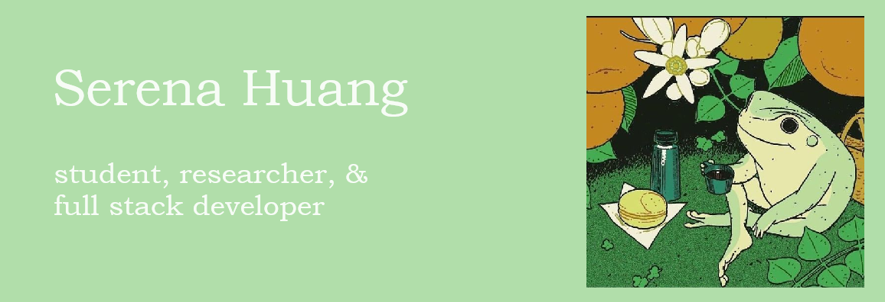

Hello there!

I'm a student hoping to explore different routes of research and eventually get a PhD! I've so far done a bit of research in quantum computing as well as dabbled a bit in machine learning. I'm currently a full-stack developer and tech director for <a href="https://www.gotechnica.org">Technica</a>, the world's largest hackathon for underrepresented genders. 

In my free time I like to read, mainly classics at the moment. If you have any book recommendations, feel free to leave them <a href="https://docs.google.com/forms/d/1ITLDFHjayh3UC1Iyn7NLsFJVuDftIl16V7WWBKOi8lQ/edit">here</a>! I also like to create music and art.

Welcome to my GitHub!
