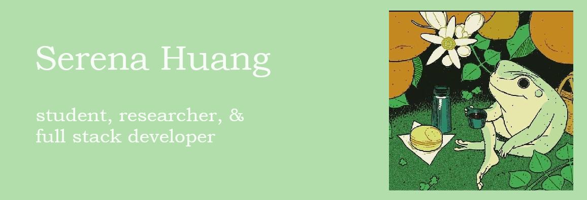

Hello there!

I'm currently a Post-Bacc working at the Lab of Physical Sciences at UMD! I've so far done research in quantum computing as well as dabbled a bit in machine learning. In the future, I plan on pursuing a PhD in quantum computing! I'm currently working on SiGe exchange-only quantum dots. I hope to do more work in the future on quantum compilers and error mitigation. Feel free to explore, but I don't actually have too much on here. Do check out <a href="https://serenajewels.github.io">my website</a> though!

In my free time I like to read, mainly classics at the moment. If you have any book recommendations, feel free to leave them <a href="https://docs.google.com/forms/d/1ITLDFHjayh3UC1Iyn7NLsFJVuDftIl16V7WWBKOi8lQ/edit">here</a>! I also like to create music and art.

Welcome to my GitHub!
